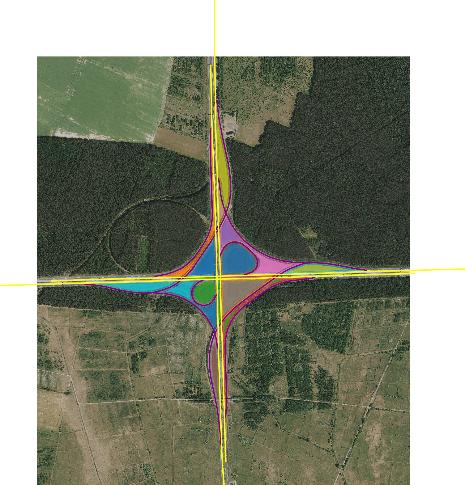
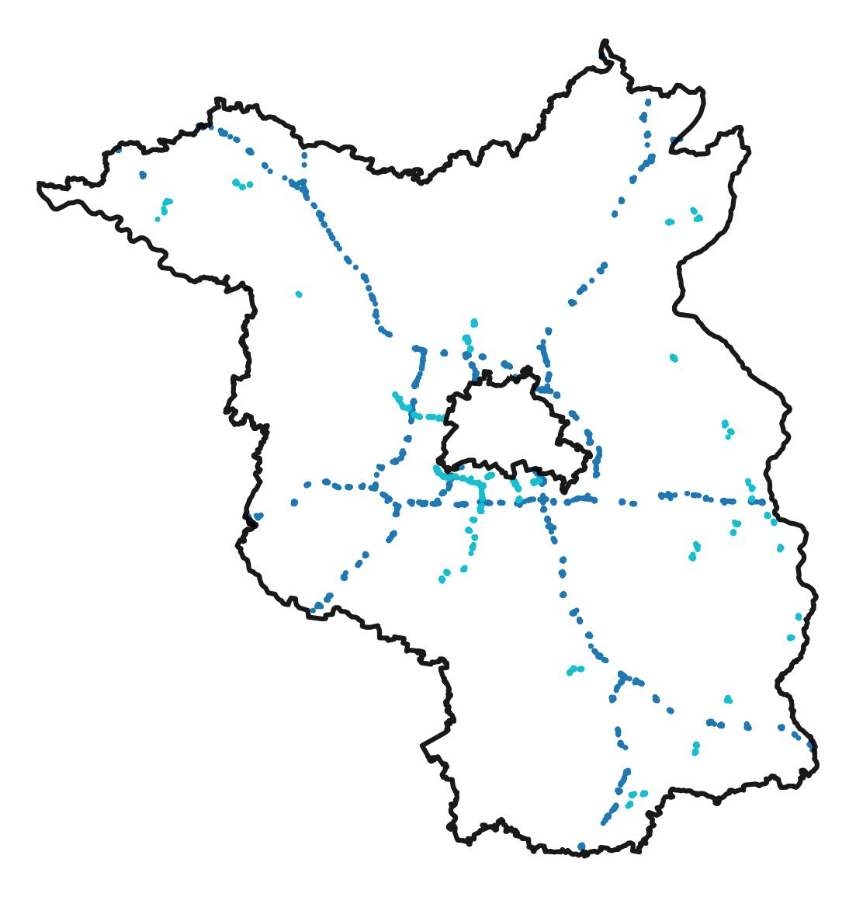
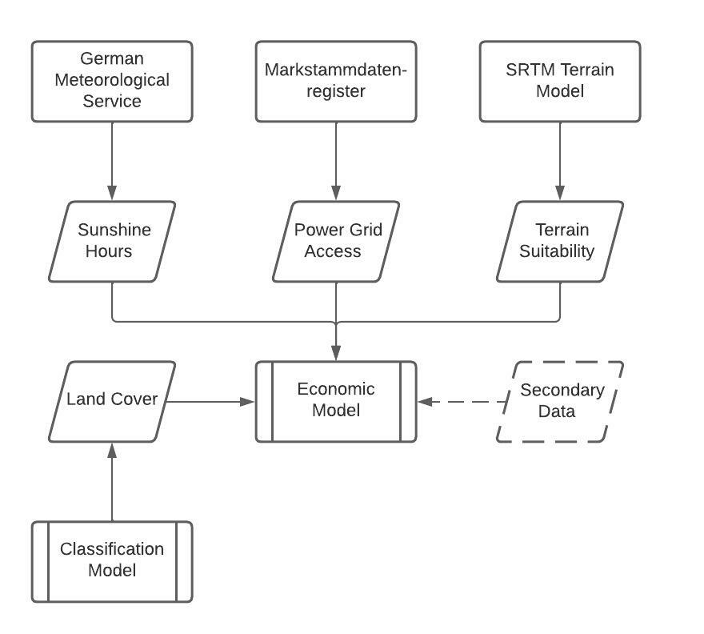

# Photovoltaics off the beaten track: Potential of solar energy in highway turnoffs across Germany

In this research project we seek to identify the potential of photovolatic power in highway turnoffs across Germany. It is currently a work in progress.

:copyright: GeoBasis-DE/LGB, OpenStreetMap

## Motivation

Global climate change has put Germany's energy industry in a state of turmoil. After years of heavy relicance on coal and gas (in 2010, 25% of the German Energy Mix were sourced this way ([BDEW, 2022](https://www.bdew.de/energie/bruttostromerzeugung-seit-2010/))), climate pledges have forced leaders to steer away towards renewables ([Bundesregierung, 2022](https://www.bundesregierung.de/breg-en/issues/climate-action/government-climate-policy-1779414)). 

While contruction of onshore wind parks is repeatedly halted by local opposition ([DW, 2022](https://p.dw.com/p/4K361)), installed photovoltaic (PV) capacity has steadily and rapidly grown in the recent years ([Bundesnetzagentur, 2022](https://www.smard.de/home/marktdaten)). One of its great benefits is the much lower footprint of the panels compared to wind parks. This allows PV to be installed in places with little other use, most prominently on house roofs. Several German states have in fact made PV mandatory on new buildings ([Imolauer, 2022](https://www.roedl.com/insights/renewable-energy/2021/august/pv-obligation-germany-federal-states)). 

Looking for further opportunities, the southern-German city of Tübingen found the space inside one of their highway ramps to be highly suited for PV use ([swt, 2022](https://www.swtue.de/energie/strom/erneuerbare-energien/bautagebuecher/solarpark-lustnauer-ohren.html)). After several years of legal hassle, the site is now the city's largest source of green energy.

Its great benefit - similar to house roofs - is that there is little alternative use cases for the area. Encircled by traffic and pollution, the city and us authors believe that PV energy production is an ingenious idea to repurpose these human-made wastelands. Germany features a large network of divided laneways in its Autobahn and Bundesstraße road systems. The many connections to local roads may serve as excellent opportunities for PV energy production in the future.

:copyright: GADM, OpenStreetMap

## Project targets

Our project seeks to provide a comprehensive overview on the potential in equiping highway turnoffs across Germany with photovoltaics. Using state-of-the-art GIS software and Machine Learning techniques we identify turnoffs and evaluate their suitability. Beginning with a limited scope on the German state of Brandenburg, we plan to extend our models to cover the entire nation's road network.

Core elements of the research project include:
- [x] Identification of highway turnoffs
- [ ] Evaluation of existing build-up and vegetation using satellite imagery and a Deep Neural Network
- [ ] Further economic considerations
  - [ ] Proximity to power grid
  - [ ] Terrain suitability
  - [ ] Macro-level wheather considerations based on sunlight
  - [ ] Optimal angle of construction and safety of passing cars
- [ ] Presentation of findings in a Dashboard

Economic suitability of a potential spot is measured with the following economic model:

---

This project is being developed as part of the Data Science in Business and Economics Master degree course at the University of Tübingen. 
